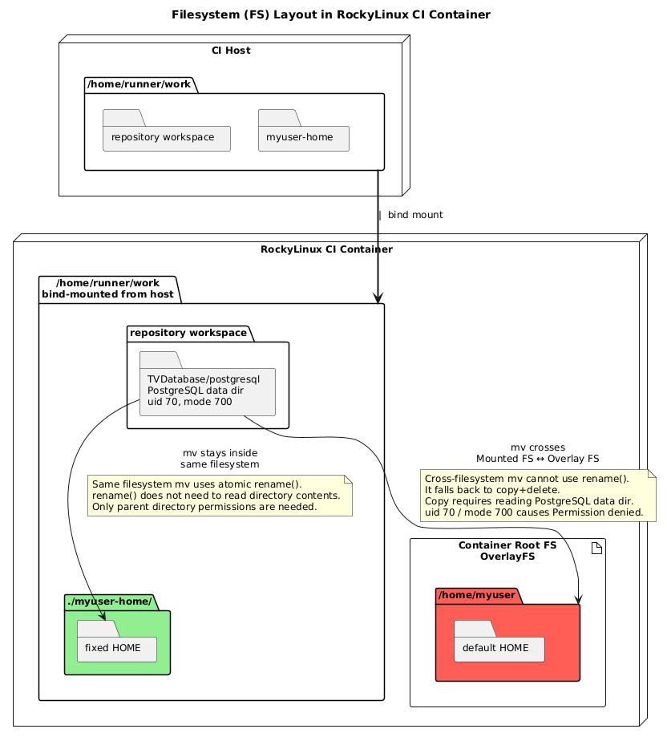

\page md_CI-CD_TiledViz_CI_Install TiledViz_CI_Install


# Documentation for TiledViz Install CI

`TiledViz_Test_Install.yml` tests the installation for Ubuntu and Rocky-Linux.

## Prerequisites for installation

| Ubuntu | Rocky-Linux | Used for |
|--|--|--|
| python3-pip | python3-pip | virtualenv + `pip3 install -r requirements.txt` |
| - | python3-devel | compiling Python C extensions (pip) |
| libcap-dev | libcap-devel | compiling Python C extensions (pip) |
| - | gcc | compiling Python C extensions (pip) |
| - | postgresql-devel | compiling `psycopg2` (pip) |
| (preinstalled) | docker-ce-cli | all `docker` commands (client only on Rocky: DooD) |
| (preinstalled) | docker-buildx-plugin | `docker build` (BuildKit) |
| - | postgresql | `psql` client (schema loading in `start_postgres`) |
| expect | expect | answering the interactive prompts |
| (preinstalled) | git | `git clone` of noVNC and websockify in `install.sh` |
| (preinstalled) | patch | `patch -p0 < ../patch_ui` in `install.sh` |
| - | dnf-plugins-core | `dnf config-manager --add-repo` (docker-ce repo) |
 | - | iptables-nft | **FireWallT dependances**
 | - | nftables | **FireWallT dependances**
 | - | openssh-server | **FireWallT dependances**
---


On Ubuntu, `git`, `patch` and the `psql` client are already preinstalled on the GitHub `ubuntu-latest` image, which is why the job does not install them explicitly. The Rocky job starts from a bare image, so its column reflects the real, complete dependency list needed for the test.

**Note**: the `$USER` is added to the docker group to allow executing Docker commands without sudo.
*In the CI we use* `chmod 666 /var/run/docker.sock` *because we can't logout to refresh the groups, but in prod it would be a major security breach.*

## Environment Variables and Secrets

The installation script (`install.sh`) and the launching script (`launch_TiledViz`) need multiple variables (server.domain, public/private SSL path, SMTP server/port address...). For security reasons, the variables are injected into the workflow using GitHub Secrets (e.g., `${{ secrets.POSTGRESQL_PASSWORD }}`) and passed as environment variables to the automation scripts, which feed them to the interactive prompts via `expect`.

## Different Jobs
Only Rocky-Linux install FireWallT the dynamic port system for TiledViz, since it blocks the communication betweeen the Ubuntu VM and GitHub. The installation is roughly the same for Ubuntu and Rocky-Linux where the major  difference resides in the path of `nftables.conf` and in more recent Ubuntu version (`22.10 or more`) SSH uses `systemd` socket-based activation instead of running as a separated service by default.
### FireWallT install
FireWallT needs `iptables-nft`, `nftables` and `openssh-server` to work correctly.
1. **Generate random SSH port** - Generate a random port between `49152` and `65535` wich is the range for dynamic and/or private ports.
1.5. **Only for ubuntu** - Replacing `ssh.socket` by `ssh.service` 
3.  **Creating the ruleset** - We accept only the random SSH, 80, and 443 ports, loopback connection and connection tracking. 
4. **Loading the rules** - We then apply the rules immediately in the running system. 

### Job 1 - Install-Ubuntu

Runs on `ubuntu-latest` GitHub runner. The steps are executed as a standard user (with a passwordless sudo).

1. **Setup and Dependencies** - Checks out the latest code of the repository and installs the required packages.

3. **Docker Config** - The GitHub runner already has `docker.io` and `docker-buildx` installed. So we just need to add the user to the docker group and give permissions on the socket (`/var/run/docker.sock`) to allow non-root execution.
4. **Mock SSL Generation** - Uses `openssl` to generate self-signed certificates in `/etc/letsencrypt/archive`.
5. **Running `install.sh`** - Uses `expect` to automatically answer the prompts using the environment variables. The installation runs **unmodified**: no patch is applied to the upstream scripts.
6. **Launch and Test** - Executes `./launch_TiledViz` and watches the process for 5 seconds. If it remains stable without exiting, the test passes.

### Job 2 - Install-Rocky-Linux

Runs on `ubuntu-latest` but installs TiledViz inside a `Rocky Linux 9` Docker container.

**Note**: By default Docker containers run as `root`. To replicate real-world usage, we create a standard user (`myuser`) with `sudo` privileges to execute the installation scripts without root.

#### Architecture: DooD (Docker-out-of-Docker)

Instead of using DinD (Docker-in-Docker), this workflow uses DooD (Docker-out-of-Docker).

The Rocky container only gets the Docker **client** (`docker-ce-cli`). By mounting the host's socket (`v/var/run/docker.sock:/var/run/docker.sock`), every Docker command issued inside Rocky is sent to the **Ubuntu host's Docker daemon**. When the installation script inside Rocky says "create a PostgreSQL container", the host creates the PostgreSQL container **next to** the Rocky Linux container, as a **sibling**, on the host's default bridge network.

- **Why doing this?**

  Nested Docker containers are notoriously unstable, suffer from performance degradation, and complicate networking. Creating sibling containers on the host's daemon is much faster, more secure, and perfectly mimics a standard server topology. In real conditions, nobody installs Docker inside a container, so the installation test remains relevant.

#### Networking: direct sibling access

Because Rocky and PostgreSQL are siblings on the same bridge network, they can reach each other **directly by container IP**, exactly like two machines on the same LAN.

This matches the upstream design: `start_postgres` starts PostgreSQL with `-e PGPORT=6431` (PostgreSQL listens on 6431 *inside* its container) and resolves the database address dynamically with `docker inspect` (re-evaluated each time `envTiledViz` is sourced). Since `docker inspect` goes through the host's daemon, it returns the real bridge IP of the PostgreSQL container (e.g. `172.17.0.x`), which is directly reachable from Rocky and from every other sibling container (Flask, connection clients...) on port 6431.

#### Filesystem: one single mount for workspace **and** home

This is the one genuine CI-specific issue, and it is solved by the mounting strategy instead of patching the install scripts.

The upstream build scripts temporarily move the PostgreSQL data directory out of the build context before each `docker build`:

```bash
mv TVDatabase/postgresql ~/tmp/   # move data dir away
docker build ...                  # clean context
mv ~/tmp/postgresql TVDatabase/   # move it back
```

The data directory is owned by the PostgreSQL container user (uid 70, mode 700), so a normal user **cannot read it** — but `mv` on the **same filesystem** uses the atomic `rename()` syscall, which does not need to read the content (only write access on both parent directories). This is why the upstream install works without root in production.

Inside a container, however, `/home/myuser` would live on the container's overlayfs while the workspace is a bind mount from the host: **two different filesystems**. `mv` across filesystems falls back to copy+delete, which *does* need to read the data dir → `Permission denied` → the data dir stays in the build context → `docker build` fails (`error from sender: open TVDatabase/postgresql/data: permission denied`) → the `flaskdock` image is never built → the server crashes at launch (`The specified image does not exist`).

**The fix**: mount the parent of the workspace (`-v /home/runner/work:/home/runner/work`) and create `myuser`'s home **inside that same mount** (`useradd -d /home/runner/work/myuser-home`). The workspace and `$HOME` are then on the same mount, `rename()` works again, and the installation runs exactly as designed upstream.

<p align="center"></p>

#### Steps

1. **Setup** - Checks out the latest code of the repository.
2. **Mock SSL Generation** - We generate the SSL certificates **before** booting Rocky, to be able to mount the directory (`-v /etc/letsencrypt:/etc/letsencrypt`).

4. **Start Rocky Linux Environment** - Compiles all secrets into a `rocky.env` file and runs the `rockylinux:9` image in the background. We mount:
   - `/var/run/docker.sock` to allow sibling container creation (DooD);
   - `/home/runner/work` (the parent of `github.workspace`) so that the install scripts *and* the future `myuser` home live on the same filesystem (see above). 
   - `/etc/letsencrypt` to provide the SSL keys at the same path on host and container.
5. **Install Prerequisites** - Installs all the system requirements, reads the host's User ID and Group ID and creates a standard user `myuser` with the same IDs, with its home directory at `/home/runner/work/myuser-home` (inside the shared mount). Adds `myuser` to the docker group and opens the socket permissions.
6. **Install TiledViz** - Generates `run_install.sh`, which uses `expect` to answer the prompts of  `install.sh`. It is run via `docker exec --user myuser rocky bash ./run_install.sh` to ensure the software is installed and configured without root privileges.
7. **Launch TiledViz** - Generates `run_launch.sh` and executes `./launch_TiledViz` (as `myuser`), answers the Flask password prompt, then watches the process for 5 seconds. If it remains stable without exiting, the test passes.

## Debugging history

Kept here so future maintainers don't reintroduce the old patches:

| Former patch | Status | Why it was removed |
|--|--|--|
| Remove `PGPORT` + route through `host.docker.internal:6431` | Removed | Sibling containers reach PostgreSQL directly on its bridge IP:6431; the upstream `docker inspect` already resolves it dynamically. These patches only fixed each other. |
| Rewrite `POSTGRES_HOST`/`POSTGRES_IP` in `~/.cache/envTiledViz` at launch | Removed | Same reason: `envTiledViz` re-evaluates `$(docker inspect ...)` at every `source`. |
| `mkdir -p $HOME/tmp` injection in `start_postgres` | Removed | Upstream now ships its own `mkdir $HOME/tmp`. |
| Replace the data-dir bind mount with a named volume (`tiledviz_db_data`) | Removed | The real cause was the cross-filesystem `mv` (see Filesystem section); solved by the shared `/home/runner/work` mount instead. |

